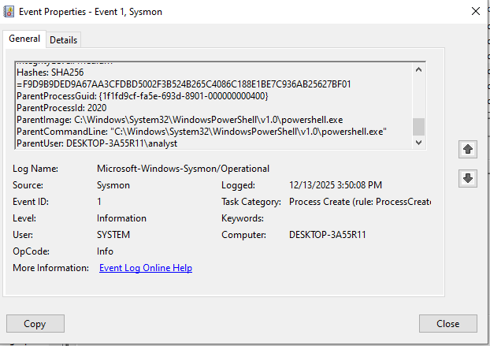

#  Windows Threat Hunting Lab Using Sysmon

##  Project Overview
This project demonstrates hands-on Windows threat hunting using Sysmon to detect suspicious process execution and persistence techniques. The lab simulates attacker-like behavior and analyzes endpoint logs to identify abnormal activity, following a SOC-style investigation workflow.

The objective was to understand how attackers abuse legitimate tools and how such behavior can be detected using endpoint telemetry.

---

##  Tools & Technologies
- Sysmon  
- Windows Event Viewer  
- PowerShell  
- Windows 10  
- Oracle VirtualBox  

---

##  Threat Simulation

The following attacker-like activities were safely simulated:

### 1️ Suspicious Execution
PowerShell was used to launch Notepad, creating an abnormal parent-child process relationship.

### 2️ Persistence Mechanism
A registry Run key entry was created to simulate persistence, a technique commonly used by malware to maintain access.

---

##  Detection & Analysis

###  Baseline Behavior (Normal)
- Parent Process: `explorer.exe`  
- Child Process: `notepad.exe`  

This represents normal user activity.

---

###  Event ID 1 – Suspicious Execution
- Parent Process: `powershell.exe`  
- Child Process: `notepad.exe`  

  


 **Analysis:**  
This behavior is suspicious because Notepad is typically launched by `explorer.exe`.  
PowerShell spawning Notepad indicates an abnormal parent-child relationship.

This pattern is commonly associated with **Living-Off-The-Land Binaries (LOLbins)** used by attackers to execute payloads while evading detection.

---

###  Event ID 13 – Registry Persistence
- Registry Path:  
  `HKCU\Software\Microsoft\Windows\CurrentVersion\Run`

  


 **Analysis:**  
The Run key is a well-known persistence mechanism used by attackers to maintain execution after system reboot or user login.

This confirms a **persistence attempt**.

---

##  Attack Chain Correlation

The detected activity was correlated into the following attack chain:

```
Execution → Persistence
PowerShell → Registry Run Key
```

This sequence reflects common attacker behavior where initial execution is followed by persistence to maintain access.

---

##  Incident Response

- Verified activity as a controlled simulation  
- Identified suspicious execution behavior  
- Detected registry-based persistence  
- Removed persistence entry  
- Restored system to a clean state  

---

##  Real-World Relevance

This project demonstrates techniques commonly observed in real-world attacks:

- Abuse of PowerShell as a **Living-Off-The-Land Binary (LOLBin)**  
- Use of registry Run keys for persistence  
- Evasion through legitimate system tools  

---

##  Skills Demonstrated

- Threat Hunting  
- Sysmon Log Analysis  
- Windows Event Log Analysis  
- Process Creation Monitoring  
- Registry Persistence Detection  
- Parent–Child Process Analysis  
- Attack Chain Correlation  
- SOC Investigation Workflow  

---

##  Project Structure

```
Windows-Sysmon-Threat-Hunting
│
├── Reports
│   ├── Final_Investigation_Summary.txt
│   └── ThreatHunting_Notes_Phase3.txt
│
├── Screenshots
│   ├── 01_sysmon_custom_config.png
│   ├── 02_sysmon_installed_files.png
│   ├── 03_powershell_admin_sysmon.png
│   ├── 04_event_viewer_sysmon_operational.png
│   ├── 05_eventid1_suspicious_powershell_notepad.png
│   ├── 06_eventid13_registry_persistence.png
│   └── 07_registry_run_key_review.png
│
└── README.md
```

---

##  Key Takeaways

- Established baseline vs suspicious behavior  
- Detected abnormal execution using Sysmon Event ID 1  
- Identified persistence using Event ID 13  
- Correlated events into a complete attack chain  
- Gained hands-on experience in SOC-style threat hunting  

---

## 📂 Project Link
👉 https://github.com/YOUR_USERNAME/Windows-Sysmon-Threat-Hunting
